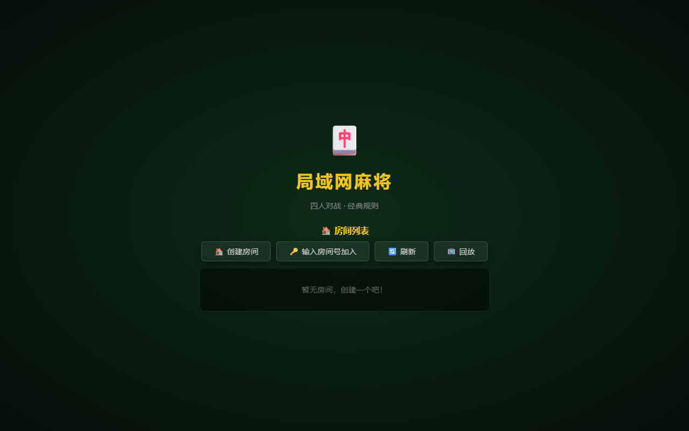
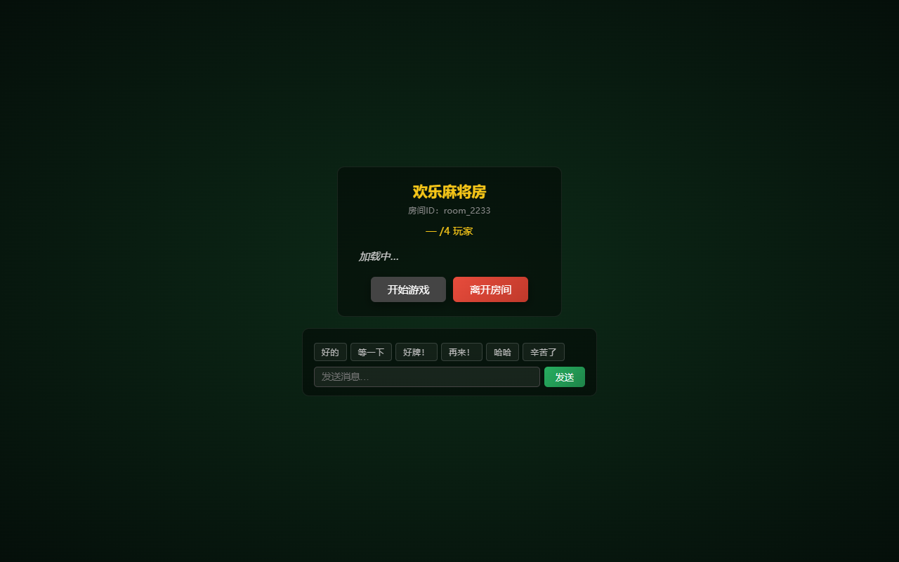
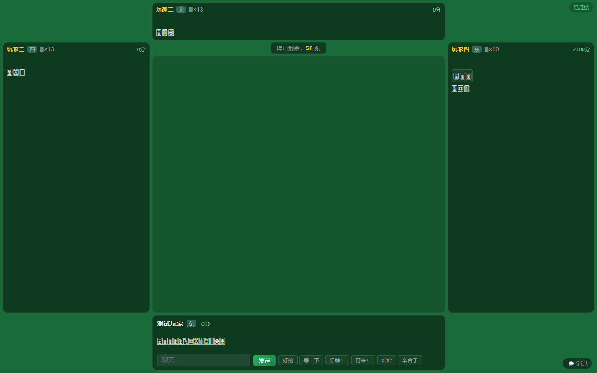
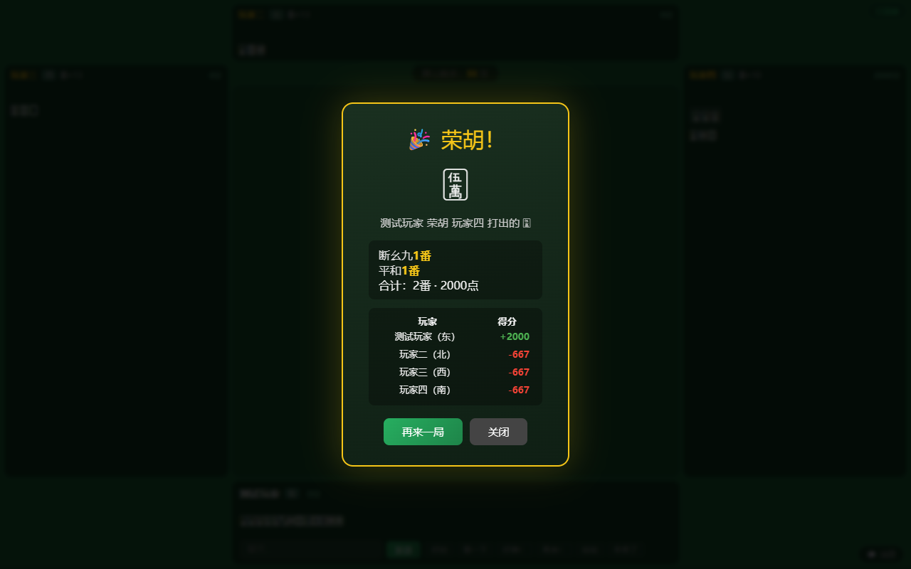
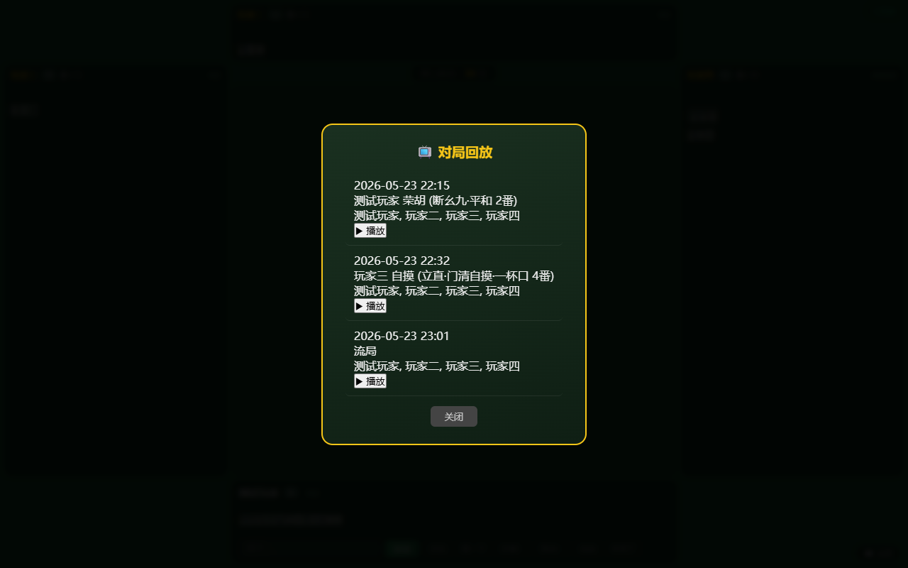

# 🀄 局域网麻将 LocalMahjongParty

一个基于 Web 技术的局域网日式麻将对战游戏，支持4人实时对战，采用前后端分离架构，通过 WebSocket 实现实时通信，适配桌面和移动设备。

## 📸 游戏截图

### 大厅界面


### 房间等待


### 游戏进行中


### 胡牌结算


### 对局回放


## ✨ 功能特性

### 🎮 核心玩法
- **日式麻将规则**：支持碰、杠（明杠/暗杠/补杠）、荣胡、自摸胡
- **特殊胡法**：天胡、地胡、岭上开花、抢杠胡
- **番型识别**：20+ 种日式番型（断幺九、立直、门清自摸、一杯口、七对子、国士无双等）
- **简化计分**：1番1000 / 2番2000 / 3番4000 / 4番+8000 / 役满32000
- **听牌提示**：听牌时自动显示进张牌
- **向听数计算**：实时计算手牌向听数

### 🏠 房间系统
- **大厅模式**：输入名字后进入大厅，查看房间列表
- **创建/加入房间**：创建房间或输入房间号加入
- **房主开局**：4人齐后由房主点击"开始游戏"
- **观战模式**：以观众身份进入房间，查看公开信息（副露、牌河、手牌数）
- **聊天功能**：房间内文字聊天 + 6条快捷短语

### 🤖 AI 托管
- 玩家断线后自动切换为 AI 托管
- 基于向听数的出牌策略：优先打孤立字牌 → 孤立数牌 → 向听数不变 → 最小向听数上升
- 胡牌必胡，能碰必碰，能杠必杠

### 📺 对局回放
- 每局自动录制完整对局过程
- 回放列表展示时间、结果、参与玩家
- 前端回放播放器，逐步回放每一手操作
- 支持下载回放 JSON 文件

### 🎨 视觉与交互
- **3D CSS 牌面**：`transform-style: preserve-3d` + `perspective` 实现立体效果
- **粒子特效**：胡牌时粒子爆发
- **飞行特效**：碰/杠时牌飞向副露区，得分飘字
- **音效系统**：Web Audio API 合成音效（摸牌、出牌、碰、杠、胡），无需外部音频文件
- **键盘操作**：1-9选牌、Space/Enter出牌、方向键导航、ESC取消
- **右键快出**：右键点击手牌直接打出
- **触屏滑动**：向上滑动 ≥30px 快速出牌，适配移动端
- **响应式设计**：桌面端与移动端自适应布局

## 🛠 技术栈

| 层级 | 技术 |
|------|------|
| 后端 | Python 3.6+、Flask、Flask-SocketIO |
| 前端 | HTML5、CSS3、JavaScript、Socket.IO Client |
| 异步引擎 | eventlet |
| 实时通信 | WebSocket（Socket.IO 协议） |
| 音频 | Web Audio API |
| 渲染 | CSS 3D Transform |

## 📦 安装与使用

### 前置条件
- Python 3.6+
- 所有玩家需处于同一局域网

### 安装步骤

```bash
# 克隆项目
git clone https://github.com/woyaoxingfua/LocalMahjongParty.git
cd LocalMahjongParty/majiang_system

# 安装依赖
pip install -r requirements.txt
```

### 启动游戏

```bash
# 启动服务器
python server.py
```

服务器启动后，玩家在浏览器访问：
- 本机：`http://localhost:5000`
- 局域网：`http://<服务器IP地址>:5000`

### 游戏流程

1. **输入名字** → 点击"进入大厅"
2. **大厅** → 创建房间 或 输入房间号加入
3. **房间等待** → 4人齐后房主点击"开始游戏"
4. **游戏中** → 选牌出牌、碰/杠/胡操作
5. **结算** → 显示番型、得分 → 点击"再来一局"

## 🎮 操作方式

### 鼠标操作
| 操作 | 说明 |
|------|------|
| 左键点击手牌 | 选中并确认出牌 |
| 右键点击手牌 | 快速出牌（跳过确认） |
| 点击操作按钮 | 碰/杠/胡/过 |

### 键盘操作
| 按键 | 说明 |
|------|------|
| `1`-`9` | 选中对应位置的手牌 |
| `Space` / `Enter` | 出牌 |
| `←` `→` | 切换选中的牌 |
| `ESC` | 取消选择 |
| `H` | 胡牌（当可胡时） |
| `P` | 碰（当可碰时） |
| `G` | 杠（当可杠时） |
| `S` | 过（跳过操作） |

### 触屏操作
| 操作 | 说明 |
|------|------|
| 点击手牌 | 选中并确认出牌 |
| 向上滑动（≥30px） | 快速出牌 |

## 📋 游戏规则

### 牌构成
- **万子**（🀇-🀏）：1-9万，各4张
- **筒子**（🀙-🀡）：1-9筒，各4张
- **条子**（🀐-🀘）：1-9条，各4张
- **字牌**（🀀-🀆）：东南西北白发中，各4张
- 共 **136** 张牌

### 简化规则说明
- **不吃**：不支持吃牌操作
- **无振听**：不采用振听规则（可随时荣胡）
- **无赤宝牌**：不使用赤宝牌（0号牌）
- **无累计番**：番数不叠加封顶，按固定计分表

### 计分表

| 番数 | 得分 |
|------|------|
| 1番 | 1000 |
| 2番 | 2000 |
| 3番 | 4000 |
| 4番+ | 8000（封顶） |
| 役满 | 32000 |

### 部分番型一览

| 番型 | 番数 | 说明 |
|------|------|------|
| 断幺九 | 1番 | 手牌（含副露）不含幺九牌 |
| 门清自摸 | 1番 | 门前清状态下自摸胡 |
| 平和 | 1番 | 门前清，4组顺子+雀头，听两边 |
| 一杯口 | 1番 | 门前清，含两组相同顺子 |
| 役牌（自风/场风/三元） | 1番/种 | 对应的风牌或三元牌刻子 |
| 三色同顺 | 2番 | 万筒条各含同数顺子 |
| 一气通贯 | 2番 | 同花色1-9连顺 |
| 七对子 | 2番 | 7组对子 |
| 对对胡 | 3番 | 4组刻子+雀头 |
| 三暗刻 | 3番 | 3组暗刻 |
| 立直 | 1番 | 门前清，宣布听牌（本作简化：门前清即视为立直） |
| 国士无双 | 役满 | 13种幺九牌各一+任一成对 |
| 清老头 | 役满 | 全部为老头牌 |

## 🏗️ 项目结构

```
majiang_system/
├── server.py          # Flask 服务器入口 + 回放 API
├── events.py          # SocketIO 事件处理（大厅/房间/聊天/观战）
├── game.py            # 核心游戏逻辑（摸牌/出牌/碰杠胡/流局）
├── room_manager.py    # 房间管理（创建/加入/离开/观战）
├── tiles.py           # 牌定义（编码/Unicode/排序/牌山生成）
├── logic.py           # 纯算法（胡牌判定/向听数/听牌计算）
├── scorer.py          # 番型识别 + 计分系统
├── ai_player.py       # AI 托管策略（出牌/操作决策）
├── replay.py          # 对局录制（JSON 格式存储）
├── templates/
│   └── index.html     # 前端单页应用（大厅/房间/游戏/回放）
├── replays/           # 回放文件存储目录（自动创建）
├── requirements.txt   # Python 依赖
└── README.md          # 本文件
```

### 模块依赖关系

```
server.py → events.py → game.py → logic.py / tiles.py / scorer.py / ai_player.py / replay.py
                              → room_manager.py
       → templates/index.html（前端）
```

## 🌐 API 接口

### HTTP 接口

| 路径 | 方法 | 说明 |
|------|------|------|
| `/` | GET | 游戏主页 |
| `/api/replays` | GET | 获取回放列表 |
| `/api/replay/<game_id>` | GET | 获取指定回放详情 |
| `/api/replay/<game_id>/download` | GET | 下载回放 JSON 文件 |

### WebSocket 事件

| 事件 | 方向 | 说明 |
|------|------|------|
| `set_username` | C→S | 设置玩家昵称 |
| `get_rooms` | C→S | 获取房间列表 |
| `create_room` | C→S | 创建房间 |
| `join_room` | C→S | 加入房间 |
| `leave_room` | C→S | 离开房间 |
| `start_game` | C→S | 开始游戏（房主） |
| `spectate_room` | C→S | 观战房间 |
| `discard_tile` | C→S | 出牌 |
| `player_action` | C→S | 响应操作（碰/杠/胡/过） |
| `room_chat` | C→S | 发送聊天消息 |
| `game_state` | S→C | 游戏状态更新 |
| `action_required` | S→C | 请求玩家操作 |
| `game_result` | S→C | 对局结果 |
| `player_disconnected` | S→C | 玩家断线通知 |

## 📄 开源协议

本项目采用 MIT 协议，详见 [LICENSE](LICENSE) 文件。
